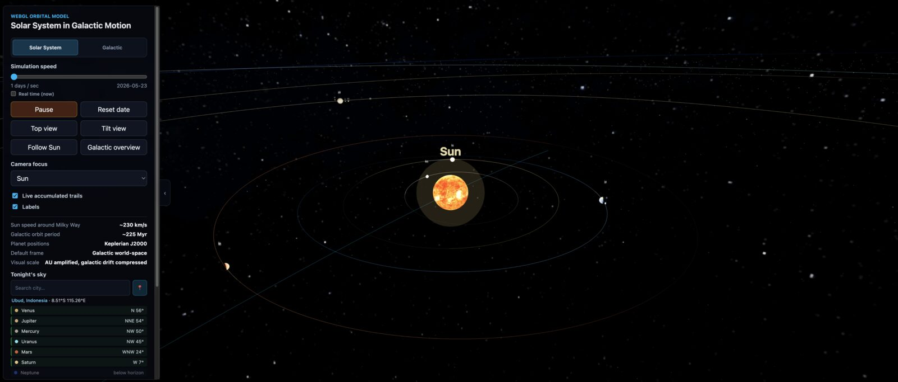
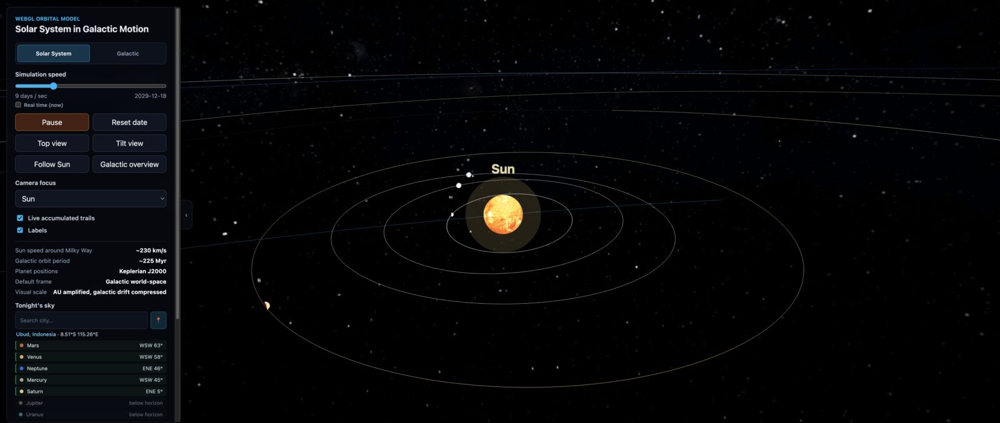
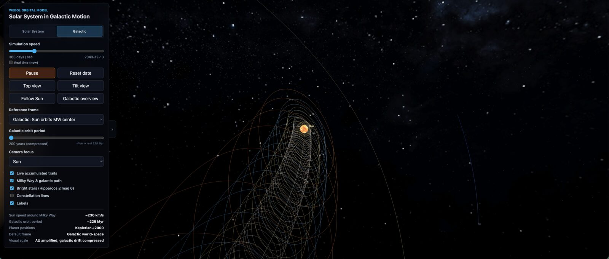
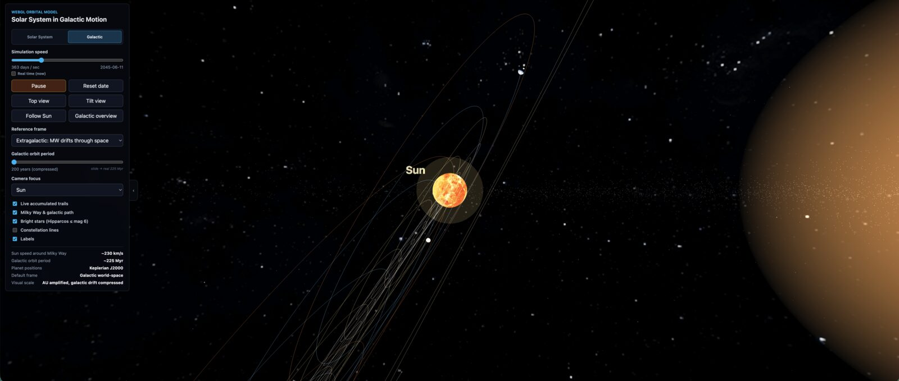

# Solar System in Galactic Motion

A WebGL simulation of the Solar System set against the broader motion of the Sun
around the Milky Way. Switch between two scales — heliocentric (planets orbiting
the Sun) and galactic (the entire Solar System drifting through the Milky Way and,
optionally, through the CMB rest frame).

**Live demo:** https://zerozeroandre.github.io/solar-galactic-webgl/

## Screenshots

### Solar mode


*All eight planets on their Keplerian orbits. The brighter leading arc of each
orbit shows the half the planet is heading into; the trailing arc fades.*


*Inner planets with live trails on: each trail brightens and white-shifts toward
the planet's current position (the "comet head" effect).*

### Galactic mode


*The Sun on a circular orbit around the Milky Way center, time-compressed so one
galactic year runs in ~200 simulated years instead of 225 Myr.*


*Extragalactic reference frame. The MW center itself drifts ~552 km/s toward the
Great Attractor (Hydra-Centaurus) in the CMB rest frame, leaving its own trail.*

## Features

### Solar mode
- Planets on Keplerian J2000 orbits with physically correct axial tilts and rotation
- Real textures for Sun, all planets and the Moon (CC BY 4.0, see attribution below)
- Saturn rings, Earth clouds and atmosphere glow for Earth/Venus
- Live "tonight's sky" panel — pick a city or use geolocation to see which planets
  are above the horizon right now, ordered by altitude
- Per-planet trails with hot-head fading and a leading-arc gradient on the static
  orbits (the orbit ahead of the planet is bright; the trailing arc fades into the
  live trail)

### Galactic mode
- Sun on a circular orbit around the Milky Way center (real shape, time-compressed
  so one galactic year runs in ~200 simulated years instead of 225 Myr)
- Galactic reference frame (Sun orbits the MW center) and extragalactic frame
  (the Milky Way itself drifts ~552 km/s toward the Great Attractor in the CMB
  rest frame) — switchable
- Hipparcos bright-star catalogue (≤ mag 6) projected on a celestial sphere
- IAU constellation lines (optional)
- Galactic disk visualization with bulge, thin/thick disks and halo

### Interaction
- Camera focus on any planet, the Sun or free-roam
- Top-down / tilted view presets, follow-Sun, galactic overview
- Adjustable simulation speed (1 day/sec up to 100 years/sec), real-time mode
- Toggle: trails, labels, Milky Way overlay, stars, constellation lines

## Scientific accuracy

Planet positions use **NASA's approximate Keplerian elements** with full 6
orbital elements and secular rates per century — sub-arcminute accuracy for
1800–2050. Eccentricities, inclinations and orbital periods are all real
values. The Sun's galactic orbit uses a real 8 kpc radius and a 60.19° tilt
between ecliptic and galactic planes. Tonight's sky panel uses standard
astronomical transforms (GMST, ecliptic↔equatorial↔horizontal) and is accurate
to ~0.5° for civil stargazing.

Planet sizes and moon distances are **deliberately enlarged** for visibility —
a literal-scale Earth would be smaller than a pixel.

See [`docs/accuracy.md`](docs/accuracy.md) for a full assessment, the list of
deliberate visual compromises, and what's missing for a stricter
implementation (N-body perturbations, VSOP87, dwarf planets, librations, etc.).

## Stack

- **Three.js** (r181) — WebGL rendering, scene graph, materials
- **Vite** (^7) — dev server and production build, no other bundler/framework
- Plain ES modules — no React, no JSX, no TypeScript compilation step

## Run locally

```bash
git clone https://github.com/ZerozeroAndre/solar-galactic-webgl.git
cd solar-galactic-webgl
npm install
npm run dev
```

Opens on `http://127.0.0.1:5178/` (port pinned via `--strictPort` — if it is
taken, the dev server fails loudly instead of silently moving to another port).

### Tests

```bash
npm test
```

Runs `scripts/verify-orbits.mjs` — a sanity check on the Keplerian model
(reproduces known planet positions at J2000 epoch).

### Build

```bash
npm run build       # outputs dist/
npm run preview     # serves dist/ on http://127.0.0.1:5178/
```

## Deployment

Deployed to GitHub Pages automatically via `.github/workflows/deploy.yml` on every
push to `main`. The `base` path in `vite.config.js` is `/solar-galactic-webgl/`
to match the Pages URL.

## Project layout

```
solar-galactic-webgl/
├── index.html              UI panel + canvas container
├── src/
│   ├── main.js             scene setup, render loop, interactions
│   ├── orbitalModel.js     Keplerian elements, planet/sun position math
│   ├── cities.js           preset city coordinates for the sky panel
│   └── styles.css
├── public/
│   ├── textures/           planet/sun/moon/MW textures + ATTRIBUTION.md
│   └── data/               Hipparcos stars and IAU constellation lines (JSON)
├── scripts/
│   └── verify-orbits.mjs   regression test for orbital math
└── vite.config.js
```

## Credits

Planet, moon, ring and starfield textures by **Solar System Scope (INOVE)** —
[solarsystemscope.com/textures](https://www.solarsystemscope.com/textures/),
licensed CC BY 4.0.

Milky Way top-down view (`milky_way_topview.jpg`) — **ESO image eso1339g**, credit
NASA/JPL-Caltech/ESO/R. Hurt, CC BY 4.0.

Full attribution: [`public/textures/ATTRIBUTION.md`](public/textures/ATTRIBUTION.md).

Bright-star catalogue: Hipparcos (ESA). Constellation line definitions: IAU.

## License

Source code: MIT.
Textures: see attribution above (CC BY 4.0, separate from the code license).
